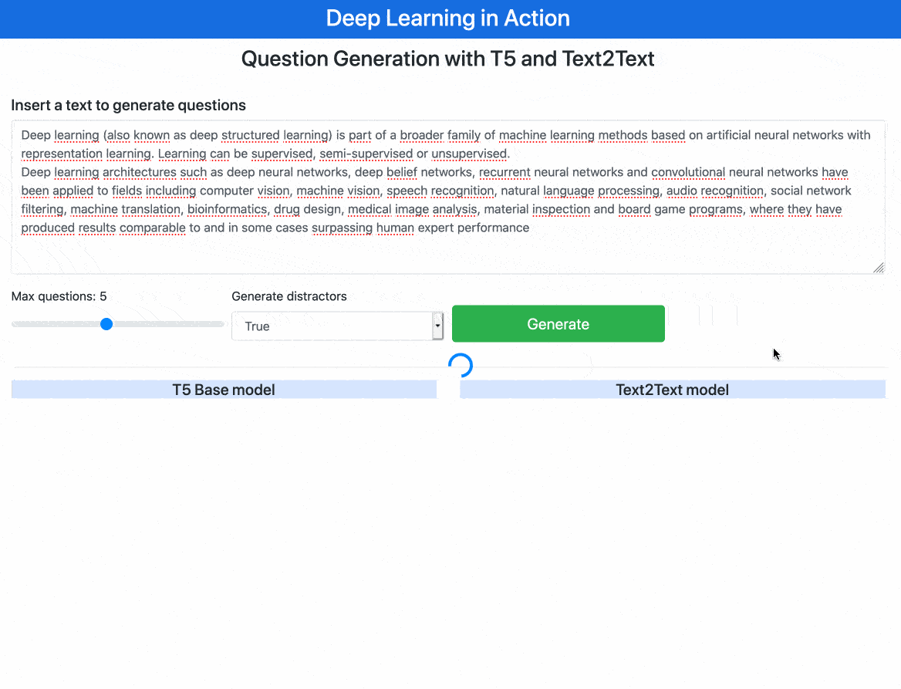

# Multiple Choice Question Generation with Google T5 and Text2Text (BERT based model)
This application uses the work from [Question Generation using Transformers 🤗](https://github.com/patil-suraj/question_generation), [text2text](https://github.com/artitw/text2text) and [Sense2Vec](https://github.com/explosion/sense2vec), together to generate questions with correct answers and distractors (when possible).

It is served with [FastApi](https://fastapi.tiangolo.com)

It's also good to compare the performace of those two models T5 and Text2Text that is BERT based.


### Application Details
1. Both model take the input text and produces questions and one correct answer for each question.
2. For each correct answer, take the this correct and feed the Sense2Vec to get most similar sentences for that correct answer.
3. Ignore the highest score similarities to produce the distractors.
4. When the answer is a noun refering to person name or entity, the Sense2Vec don't find a candidate and the return is none. 



### Running 
1. Download [Sense2Vec Pretrained Vectors](https://github.com/explosion/sense2vec/releases/download/v1.0.0/s2v_reddit_2015_md.tar.gz).
2. Extract the content in the root folder. Will be created a folder named s2v_old.

```
pip install -r requirements.txt
uvicorn app:app --reload --log-level debug
```

Open your browser http://localhost:8000


### Disclaimer
Feel free to fork, improve and share. If you improve, let me know the improvements.

